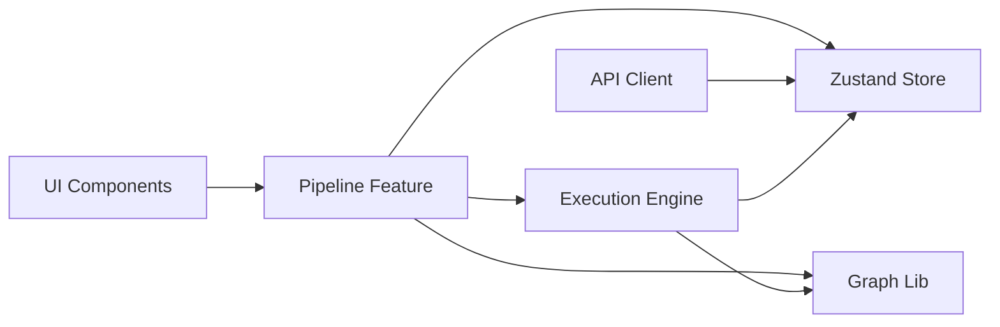

# Visual AI Pipeline Editor

A production-style web app for building and running AI pipelines as a **Directed Acyclic Graph (DAG)**. Users fetch node types from an API, drag nodes onto a canvas, connect them with validated edges, and execute the pipeline with simulated node runs and live logs.

## Quick start

**With Docker (recommended)** — all dependencies are isolated in containers (no system installs required except Docker).

```bash
./run.sh --action start
```

Builds and launches Frontend + Backend. Frontend: http://localhost:3000 · Backend: http://localhost:4000

```bash
./run.sh --action terminate
```

Stops and removes containers, volumes, and networks cleanly. Short form: `./run.sh start` and `./run.sh terminate` also work.

**Local development**

```bash
# Terminal 1 – backend
cd backend && npm install && npm run dev

# Terminal 2 – frontend (proxies /api to backend)
cd frontend && npm install && npm run dev
```

Open http://localhost:5173 (Vite). The frontend proxies `/api` to the backend.

---

## Architecture

- **Frontend**: React 18, Vite, React Flow, Zustand, React Query, Tailwind.
- **Backend**: Node.js (Express), mock `GET /api/nodes` with a 1s delay.
- **Layering**: UI → feature modules → state (Zustand) + graph/execution libs → API.



- **UI**: Thin components (palette, canvas, logs, status).
- **Feature**: Pipeline page, hooks (`usePipeline`, `useExecution`, `useRunPipeline`), store.
- **State**: Single Zustand store (nodes, edges, execution state, logs, UI flags).
- **Graph lib**: Pure functions (validation, cycle detection, topological sort).
- **Execution engine**: Async runner that uses topological order and callbacks; no React.
- **API**: React Query for `GET /api/nodes`; draft persistence in `localStorage`.

---

## Graph logic (DAG)

1. **Connection rules** (in `lib/graph/validation.ts`):
   - No self-loops.
   - Type order: **Data Source → Transformer → Model → Sink** (fixed in code).
   - No cycles: before adding an edge, cycle detection is run on the graph that would result.

2. **Cycle detection** (`lib/graph/cycleDetection.ts`): DFS with a path set; if a node is re-entered on the current path, there is a cycle. O(V+E).

3. **Execution order** (`lib/graph/topologicalSort.ts`): **Kahn’s algorithm** (in-degrees, queue of zeros). Gives a deterministic order and naturally reflects “levels” (sources first, then next layer). If the sorted sequence has fewer nodes than the graph, a cycle exists.

---

## Execution engine

- **Input**: Current `nodes` and `edges` from the store.
- **Steps**:
  1. Topological sort; if the result is incomplete (cycle), report error and stop.
  2. For each node in order: set state to `running`, simulate work (delay + logs), set to `completed` (or `error` on failure).
- **Output**: All state changes go through callbacks (`onNodeState`, `onLog`, `setRunning`, etc.); the feature layer pushes these into Zustand. The engine is decoupled from React and easy to test.

---

## Project structure

```
ai-pipeline/
├── frontend/
│   ├── src/
│   │   ├── app/              # App shell, providers
│   │   ├── features/pipeline # Palette, canvas, logs, store, hooks
│   │   ├── shared/           # Button, Modal, constants
│   │   ├── services/         # API client, draft (localStorage)
│   │   ├── lib/
│   │   │   ├── graph/        # validation, cycleDetection, topologicalSort
│   │   │   └── execution/    # executionEngine
│   │   ├── types/
│   │   └── utils/            # reactFlow mapping, logger
│   └── Dockerfile
├── backend/
│   ├── src/                  # Express, GET /api/nodes, mock data
│   └── Dockerfile
├── docker-compose.yml
├── run.sh
└── README.md
```

---

## Tradeoffs and future work

- **State**: One Zustand store for simplicity; for very large graphs, splitting graph vs execution state or normalizing nodes/edges could help.
- **Draft**: localStorage only, 24h lifetime; no backend persistence.
- **Execution**: Simulated (fixed delay + logs); real runs would plug in backend calls or workers.
- **Optional improvements**: Animated edges during run, onboarding modal, export/import JSON, undo/redo (e.g. Zustand middleware).

---

## License

MIT.
